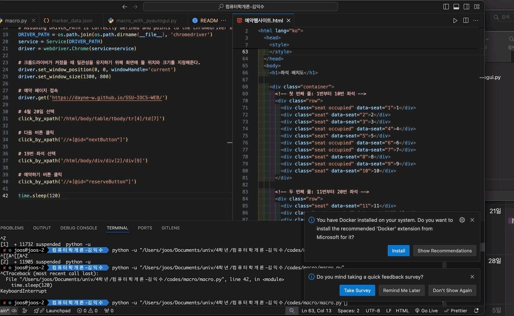
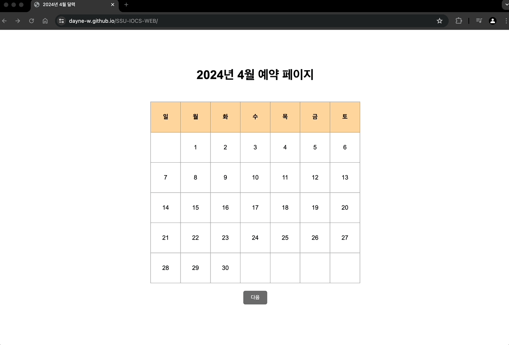

## 2024년 1학기 컴퓨터학개론(공통반) - 5조

### 주제: 매크로 프로그램을 사용한 부정 예약을 탐지하는 기술 제안

#### 1. 폴더 구조  
.  
├── README.md    
├── aws-lambda    
│     └── is_macro_aws_lambda.py  
├── macro-program  
│      ├── macro.py  
│      └── macro_with_pyautogui.py  
├── index.html  
└── 예약웹사이트.html  

- aws-lambda/is_macro_aws_lambda.py :
  - 마우스 이동경로 좌표를 받아 매크로 여부를 판단하는 AWS Lambda 함수 코드입니다.
- macro-program/macro.py :
  - HTML 문서상의 선택자를 이용하여 클릭 명령을 보내는 방식의 매크로 프로그램
- macro-program/macro_with_pyautogui.py :
  - pyautogui 라이브러리를 활용하여 마우스를 직접 제어하여 클릭하는 방식의 매크로 프로그램
- index.html : 
  - 날짜 선택 페이지
- 예약웹사이트.html :
  - 좌석 선택 페이지

#### 2. 매크로 프로그램 실행 방법 
https://googlechromelabs.github.io/chrome-for-testing/

1. 위 링크에서 프로그램을 실행할 컴퓨터의 OS 와 Chrome 의 현재 버전과 일치하는 ChromeDriver 를 다운로드 받습니다.
2. 다운로드 받은 ChromeDriver 엔진을 실행할 매크로프로그램(python 파일)과 같은 폴더 내에 저장합니다.
3. 필요한 경우 라이브러리를 직접 install 하고 실행합니다. (selenium, pyautogui, ...등)
   3-1. OS 에 따라 마우스 제어 권한 문제가 발생할 수 있습니다. 마우스 제어 권한을 허용해주셔야 합니다.

#### 3. 실행 사진

1. 매크로 프로그램을 이용하여 예약 시

2. 손으로 직접 예약 시
